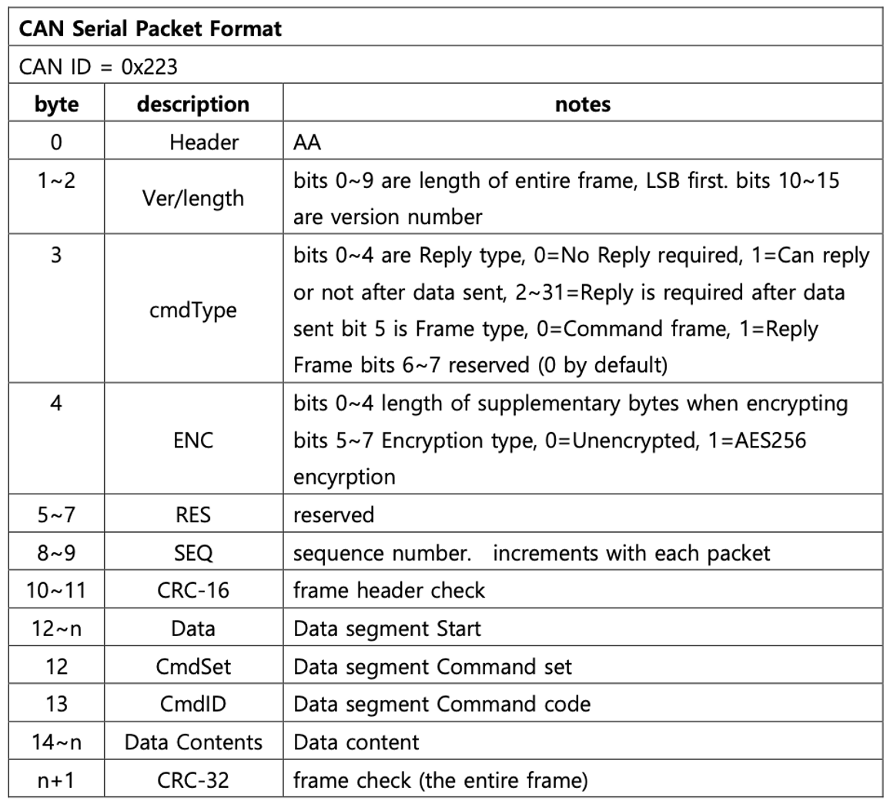
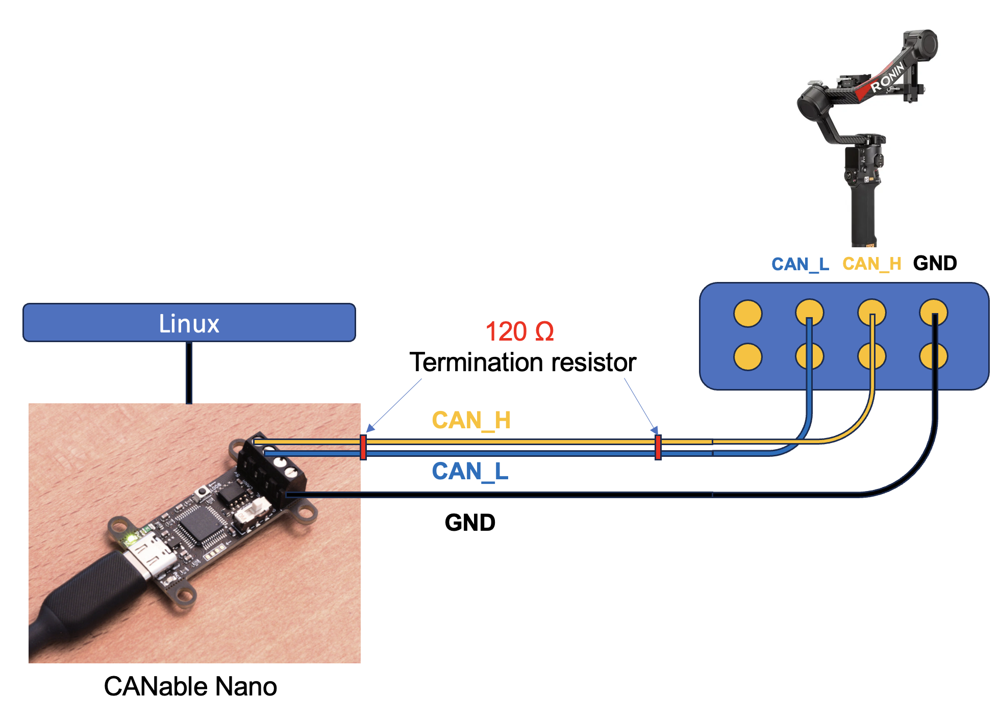

# CAN-RS4
Controlled DJI RS4 gimbal via CAN communication.

# DJI RS4 Gimbal CAN Control Project

DJI사의 RS4 짐벌을 CAN 통신을 통해 제어하는 프로젝트입니다.  
본 프로젝트는 Python 기반 코드와 SocketCAN 환경에서 DJI의 RS4 짐벌을 제어합니다.

---

## 프로젝트 개요

- DJI RS4 짐벌을 CAN 통신으로 제어
- 기존 Mission Planner에서 사용되던 Lua 스크립트 분석:  
  [`mount-djirs2-driver.lua`](https://github.com/ArduPilot/ardupilot/blob/master/libraries/AP_Scripting/drivers/mount-djirs2-driver.lua)
- Python 스크립트를 통해 `send_gimbal_angle()` 함수로 짐벌 각도 제어
- 각도 전환 시간은 기본값 2초이며 설정 가능

---

## CAN 프로토콜 형식

| 항목               | 값                           |
|--------------------|------------------------------|
| CAN ID             | `0x223`                      |
| 전송 속도          | `1 Mbps`                     |
| 오류 검출 방식     | DJI 자체 CRC16 / CRC32 사용 |
| 데이터 전송 구조   | 8바이트 분할 전송 방식 적용 |

---

## 하드웨어 구성

| 구성 요소                 | 설명                              |
|--------------------------|-----------------------------------|
| USB-CAN Adapter          | **CANable Nano v1.0**             |
| 종단 저항                | 120Ω 2개                          |
| 짐벌 연결용 커넥터       | **커넥터 직접 제작 필요, 상단에 자작 커넥터 구성도 기술** |
| 케이블 연결              | 공통 GND, CAN_H, CAN_L                 |
| OS                       | Linux (Ubuntu 등)                 |

---

## 실행 방법

1. CAN Adapter를 Linux에 연결 후 `lsusb`로 연결 확인
2. `sudo ip link set can0 up type can bitrate 1000000` , 1Mbps로 CAN Adapter 활성화
3. `python3 CAN_Send.py` , 코드 실행

---

## 기술 스택

- **Physical Layer**: CANable Nano, 120Ω 종단저항
- **Kernel Layer**: SocketCAN (Linux Native)
- **Tool Layer**: `can-utils`, `python-can`
- **Application Layer**: Python 코드 제어

---

# Q&A

- 질문 또는 기술적 문의는 아래 이메일로 연락 주세요.
- jw6258@sch.ac.kr

---

# License

This project is based on code licensed under the MIT License.

Portions of this code are derived from:
- [ArduPilot mount-djirs2-driver.lua](https://github.com/ArduPilot/ardupilot/blob/master/libraries/AP_Scripting/drivers/mount-djirs2-driver.lua)
